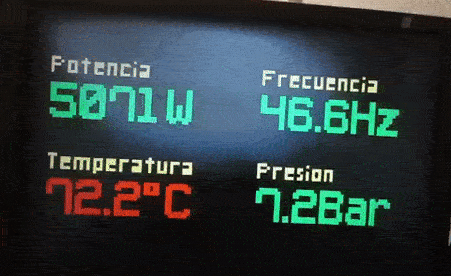

# vga nano
> Use an VGA as a data display with arduino nano

## Summary
This project uses the [VGAX](https://github.com/smaffer/vgax) library from [smaffer](https://github.com/smaffer). Please, go to his repo to see the wiring, features and examples.

## Tweaks
A copy of the library is in this repo because it was necessary to reduce the resolution in order to have more space for dynamic variables
 
